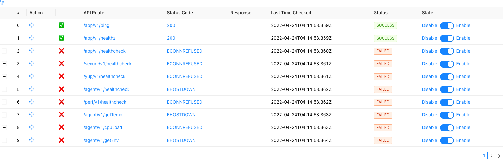
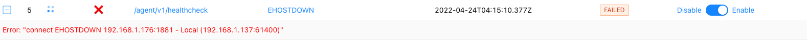

[](https://github.com/pre-commit/pre-commit)

Healthcheck Monitoring Dashboard : Using this application we can easily monitor all the API or Service healthcheck and keep track of their status . This application will monitor preodically based on preconfigured time intervals in config file . Dashboard will show the status check mark with clour code and status code message . In case of any error we can view the Error message .

## Archtecture :

Dashboard --> (ReactJS) --> (NodeJS) --> Target API's \

```bash
"proxy": http://localhost:3838
```




## Getting Started with Healthcheck Monitoring

---

```bash
npm install

npm run build

Runs the app [ node server.js / nodemon server.js / pm2 start server.js ]\
Open [http://localhost:3838](http://localhost:3838) to view it in the browser.
or, Direct React UI using [http://localhost:3001](http://localhost:3001)
```

---

## Setting up .env

```bash
chmod 777 start.sh
./start.sh
or,
touch .env
STATUS_SERVER_URL=http://localhost:3838
```

## Running pre-commit checks

[pre-commit](https://pre-commit.com) installs git hooks configured in [.pre-commit-config.yaml](.pre-commit-config.yaml)

Install `pre-commit` and `commitizen` to use

---

```bash

brew install commitizen
brew install pre-commit

pre-commit install
pre-commit install --hook-type commit-msg

pre-commit run --all-files
```

---

## Update package.json with the latest version of all dependencies

```bash
npm install -g npm-check-updates
ncu -u
npm install

```
